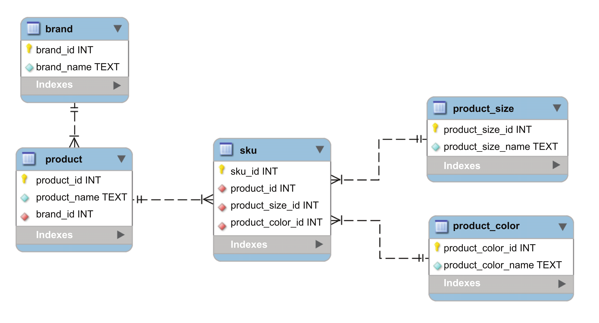

# 05 - Asynchronous Database Interaction

In this section, our goal is to work with a database. Since our application is asynchronous, we need an asyncio-compatible library.

To ensure you can follow along smoothly, run the following Docker command to set up a PostgreSQL instance:

```shell
docker build -t my-postgres .
docker run -d --name my-postgres-container -p 5432:5432 my-postgres
```

Next, we’ll verify our connection to the database:

```python
import asyncio
import asyncpg


async def main():
    conn = await asyncpg.connect(
        host="127.0.0.1",
        port=5432,
        user="postgres",
        database="postgres",
        password="password",
    )
    version = conn.get_server_version()
    print(f"Connected! Postgres version is {version}")

asyncio.run(main())
```

The image below depicts the entity relationship for our test data:



To set up the database with some initial data, run the following commands:

```python
cd code
python setup_products_database.py
```

## Executing independent queries

Up to this point, we’ve been executing our queries sequentially. But what if we want to leverage the power of asynchronous execution? Now that we have the data set up, let’s fetch all SKUs for a specific product asynchronously:

```python
import asyncpg
import asyncio
import textwrap


async def main():
    conn = await asyncpg.connect(
        host="127.0.0.1",
        port=5432,
        user="postgres",
        database="products",
        password="password",
    )

    product_query = textwrap.dedent("""
        SELECT p.product_id,
            p.product_name,
            p.brand_id,
            s.sku_id,
            pc.product_color_name,
            ps.product_size_name
        FROM   product AS p
            JOIN sku AS s
                ON s.product_id = p.product_id
            JOIN product_color AS pc
                ON pc.product_color_id = s.product_color_id
            JOIN product_size AS ps
                ON ps.product_size_id = s.product_size_id
        WHERE  p.product_id = 100  
    """)
    queries = [
        conn.execute(product_query),
        conn.execute(product_query),
    ]
    results = await asyncio.gather(*queries)
    for record in results:
        print(record)

    await conn.close()


asyncio.run(main())
```

> [!NOTE]
>
> In SQL, a single connection means <u>one socket to the database</u>. Attempting to read results from multiple queries concurrently on this single connection causes an error. This is where connection pool comes into the picture.

Instead of creating a single connection, we’ll set up a connection pool 🤯.

```python
import asyncio
import textwrap

import asyncpg


product_query = textwrap.dedent("""
    SELECT p.product_id,
        p.product_name,
        p.brand_id,
        s.sku_id,
        pc.product_color_name,
        ps.product_size_name
    FROM   product AS p
        JOIN sku AS s
            ON s.product_id = p.product_id
        JOIN product_color AS pc
            ON pc.product_color_id = s.product_color_id
        JOIN product_size AS ps
            ON ps.product_size_id = s.product_size_id
    WHERE  p.product_id = 100  
""")


async def query_product(pool):
    async with pool.acquire() as conn:
        return await conn.fetchrow(product_query)


async def main():
    pool = await asyncpg.create_pool(
        host="127.0.0.1",
        port=5432,
        user="postgres",
        database="products",
        password="password",
        min_size=6,
        max_size=6,
    )

    queries = [
        query_product(pool),
        query_product(pool),
    ]
    await asyncio.gather(*queries)

    await pool.close()


asyncio.run(main())

```

Here, we’re not encountering any errors because each connection acquired from the pool is dedicated and not shared with others.

As they say, "Comparison is the thief of joy," but today, it’s the key to our success! 🎉

```python
import asyncio
import textwrap

import asyncpg

from code.utils import async_timed


product_query = textwrap.dedent("""
    SELECT p.product_id,
        p.product_name,
        p.brand_id,
        s.sku_id,
        pc.product_color_name,
        ps.product_size_name
    FROM   product AS p
        JOIN sku AS s
            ON s.product_id = p.product_id
        JOIN product_color AS pc
            ON pc.product_color_id = s.product_color_id
        JOIN product_size AS ps
            ON ps.product_size_id = s.product_size_id
    WHERE  p.product_id = 100  
""")


async def query_product(pool):
    async with pool.acquire() as conn:
        return await conn.fetchrow(product_query)


@async_timed()
async def query_products_synchronously(pool, queries):
    return [await query_product(pool) for _ in range(queries)]


@async_timed()
async def query_products_concurrently(pool, queries):
    queries = [query_product(pool) for _ in range(queries)]
    return await asyncio.gather(*queries)


@async_timed()
async def main():
    pool = await asyncpg.create_pool(
        host="127.0.0.1",
        port=5432,
        user="postgres",
        database="products",
        password="password",
        min_size=6,
        max_size=6,
    )
    await query_products_concurrently(pool, 10_000)

    await query_products_synchronously(pool, 10_000)

    await pool.close()


asyncio.run(main())

```

However, working with databases comes with its risks. If something goes wrong, the database state could become inconsistent! This is where database transactions come into play.

As you might know, a transaction ensures that you can either **commit** your changes to save them or **roll back** to undo them, preserving data integrity.

```python
import asyncio
import asyncpg


async def main():
    conn = await asyncpg.connect(
        host="127.0.0.1",
        port=5432,
        user="postgres",
        database="products",
        password="password",
    )
    async with conn.transaction():
        await conn.execute("INSERT INTO brand " "VALUES(9999, 'brand_1')")
        await conn.execute("INSERT INTO brand " "VALUES(9999, 'brand_2')")
    await conn.close()


asyncio.run(main())

```

## Asynchronous generators and streaming result sets

One limitation of the default `fetch` method in `asyncpg` is that it loads all the query results into memory at once, which can be inefficient for large datasets. However, PostgreSQL supports streaming query results using cursors, allowing rows to be processed incrementally as they are retrieved.

In `asyncpg`, this is achieved with asynchronous generators, which facilitate efficient row-by-row handling.

Let’s start by understanding the fundamentals.

```python
from typing import Generator


def count(until: int) -> Generator[None, None, int]:
    for idx in range(until):
        yield idx
        
for num in count(3):
    print(num)
```

Is it possible to achieve something similar in an asynchronous manner?

```python
import asyncio
from typing import AsyncGenerator


async def count(until: int) -> AsyncGenerator[None, int]:
    for idx in range(until):
        yield idx


async def main():
    async for num in count(3):
        print(num)


asyncio.run(main())

```

With this understanding, let’s dive into `asyncpg` cursors, shall we?

```python
import asyncio
import asyncpg


async def main():
    conn = await asyncpg.connect(
        host="127.0.0.1",
        port=5432,
        user="postgres",
        database="products",
        password="password",
    )

    query = "SELECT product_id, product_name FROM product"
    async for product in conn.cursor(query):
        print(product)

    await conn.close()


asyncio.run(main())

```

