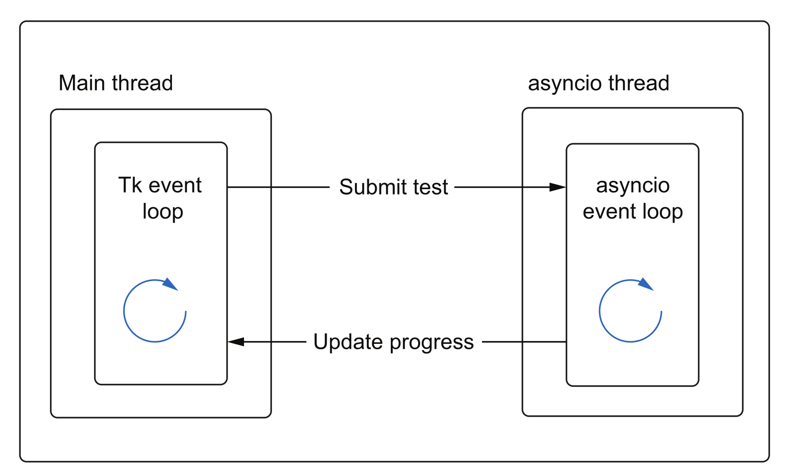

# Multi-threading

So far, we’ve introduced asyncio-friendly libraries for web and database operations. However, there are situations where an asyncio-compatible library may not be available. In such cases, Python’s multithreading library can be a valuable alternative. First, we’ll cover the basics of multithreading, and then we’ll delve into integrating a thread pool with the asyncio event loop.

## Introducing the threading module

As a reminder, the Global Interpreter Lock (GIL) ensures that only one thread executes Python bytecode at any given time. However, there are scenarios where the GIL is released, the most notable being during I/O operations. This is because system calls, which handle I/O, operate outside the Python interpreter and do not require Python bytecode execution while waiting for I/O to complete.

To put this into practice, we’ll revisit the echo server and rewrite it using a thread-per-connection model.

```python
from threading import Thread
import socket


def echo(client: socket.socket):
    while True:
        data = client.recv(2048)
        print(f"Received {data}, sending!")
        client.sendall(data)


def main():
    with socket.socket(socket.AF_INET, socket.SOCK_STREAM) as server:
        server.setsockopt(socket.SOL_SOCKET, socket.SO_REUSEADDR, 1)
        server.bind(("127.0.0.1", 8000))
        server.listen()
        while True:
            threads = threading.enumerate()
            print(threads)
            connection, _ = server.accept()  # A
            thread = Thread(target=echo, args=(connection,))  # B
            thread.start()  # C


if __name__ == "__main__":
    main()

```

This solution works, but there are some important considerations:

First, what happens if we try to terminate the process using CTRL-C while clients are still connected? It turns out that the shutdown process isn’t as clean as we’d like. User-created threads in Python do not receive KeyboardInterrupt exceptions; only the main thread does.

1. **Daemon Threads**: Change the threads to daemon threads. Daemon threads do not block the application from shutting down, which fixes the issue. However, daemon threads terminate abruptly, making it impossible to perform shutdown or cleanup logic.
2. **Custom Thread Cancellation**: Design a custom approach to cancel threads gracefully, allowing proper cleanup before termination.

```python

def echo(client: socket.socket):
    while True:
        data = client.recv(2048)
        client.sendall(data)


def main():
    with socket.socket(socket.AF_INET, socket.SOCK_STREAM) as server:
        server.setsockopt(socket.SOL_SOCKET, socket.SO_REUSEADDR, 1)
        server.bind(("127.0.0.1", 8000))
        server.listen()
        while True:

            conn, _ = server.accept()  # A
            print(f"Got a connection: {conn}")
            thread = Thread(target=echo, args=(conn,))  # B
            thread.daemon = True
            thread.start()  # C


if __name__ == "__main__":
    main()
```

To implement custom logic for canceling threads, we can subclass `Thread` and define our custom behavior in the `run` method. Additionally, we can introduce a `close` method to ensure the client socket is properly closed when the thread is terminated.

```python
from threading import Thread
import socket
import threading


class ClientEchoThread(Thread):
    def __init__(self, client: socket.socket):
        super().__init__()
        self.client = client

    def run(self):
        try:
            while True:
                data = self.client.recv(2048)
                if not data:  # A
                    raise BrokenPipeError("Connection closed!")
                print(f"Received {data}, sending!")
                self.client.sendall(data)
        except OSError as e:  # B
            print(f"Thread interrupted by {e} exception, shutting down!")

    def close(self):
        if self.is_alive():  # C
            self.client.sendall(bytes("Shutting down!", encoding="utf-8"))
            self.client.shutdown(socket.SHUT_RDWR)  # D


def main():
    with socket.socket(socket.AF_INET, socket.SOCK_STREAM) as server:
        server.setsockopt(socket.SOL_SOCKET, socket.SO_REUSEADDR, 1)
        server.bind(("127.0.0.1", 8000))
        server.listen()
        threads: list[ClientEchoThread] = []

        try:
            while True:
                conn, _ = server.accept()  # A
                print(f"Got a connection: {conn}")
                thread = ClientEchoThread(conn)
                thread.start()
                threads.append(thread)
        except KeyboardInterrupt:
            print('Shutting down...')
            for thread in threads:
                thread.close()


if __name__ == "__main__":
    main()

```

Now that we’ve covered the basics of threading, let’s explore how to integrate it with `asyncio` for working with popular blocking libraries. Keep in mind that with this approach, you’ll need to manage threads manually. However, as we learned earlier, using a `ThreadPoolExecutor` simplifies this process significantly.

Let’s see it in action:

```python
import requests
from concurrent.futures import ThreadPoolExecutor

from code.utils import sync_timed


def get_status_code(url: str) -> int:
    response = requests.get(url)
    return response.status_code


@sync_timed()
def simple_sync():
    urls = ["https://www.example.com" for _ in range(100)]
    for url in urls:
        get_status_code(url)


@sync_timed()
def main():
    with ThreadPoolExecutor() as executor:
        urls = ["https://www.example.com" for _ in range(100)]
        results = executor.map(get_status_code, urls)
        for r in results:
            print(r)


main()

```

Recall that we made 1,000 requests concurrently in under a second. However, our maximum number of workers (threads) is capped at 32, meaning we can only process up to 32 requests simultaneously by default. While this approach outperformed the synchronous version, it still falls short of the efficiency achieved with coroutine-based code.

## Integration

Let's integrate out thread pool executors with `asyncio`

```python
import functools
import requests
import asyncio
from concurrent.futures import ThreadPoolExecutor

from code.utils import sync_timed


def get_status_code(url: str) -> int:
    response = requests.get(url)
    return response.status_code


@sync_timed()
def simple_sync():
    urls = ["https://www.example.com" for _ in range(100)]
    for url in urls:
        get_status_code(url)


@sync_timed()
def main():
    tasks: list[asyncio.Future] = []
    with ThreadPoolExecutor() as executor:
        url = "https://www.example.com"
        loop = asyncio.get_running_loop()
        calls = [functools.partial(get_status_code, url) for _ in range(100)]
        for call in calls:
            tasks.append(loop.run_in_executor(executor, call))
        results = asyncio.gather(*tasks)
        print(results)


if __name__ == "__main__":
    asyncio.run(main())
```

> [!NOTE]
>
> This approach doesn’t provide any performance advantage over using a pool without asyncio. However, while `await asyncio.gather` is running, other code can execute concurrently.

### default executors

```python
import functools
import requests
import asyncio

from code.utils import sync_timed


def get_status_code(url: str) -> int:
    response = requests.get(url)
    return response.status_code


@sync_timed()
def simple_sync():
    urls = ["https://www.example.com" for _ in range(100)]
    for url in urls:
        get_status_code(url)


@sync_timed()
def main():
    tasks: list[asyncio.Future] = []
    url = "https://www.example.com"
    loop = asyncio.get_running_loop()
    calls = [functools.partial(get_status_code, url) for _ in range(100)]
    for call in calls:
        tasks.append(loop.run_in_executor(None, call))
    results = asyncio.gather(*tasks)
    print(results)


if __name__ == "__main__":
    asyncio.run(main())

```

To simplify things further, Python introduced `asyncio.to_thread`, which runs a synchronous function with the provided arguments. This eliminates the need to use the `partial` method. 🤷‍♂️

```python
import functools
import requests
import asyncio

from code.utils import sync_timed


def get_status_code(url: str) -> int:
    response = requests.get(url)
    return response.status_code


@sync_timed()
def simple_sync():
    urls = ["https://www.example.com" for _ in range(100)]
    for url in urls:
        get_status_code(url)


@sync_timed()
def main():
    tasks: list[asyncio.Future] = []
    url = "https://www.example.com"
    tasks = [asyncio.to_thread(get_status_code, url) for _ in range(100)]
    results = asyncio.gather(*tasks)
    print(results)


if __name__ == "__main__":
    asyncio.run(main())

```

Multithreaded code is prone to race conditions when working with shared data, as the order of execution is not under our control. Unlike multiprocessing, where shared memory must be explicitly created, threads share the memory of their parent process, allowing direct access to shared variables.

For example, let’s safely count the number of get_status_code operations performed:

```python
import functools
from threading import Lock
import time
import requests
import asyncio
from concurrent.futures import ThreadPoolExecutor

from code.utils import async_timed

counter_lock = Lock()
counter: int


async def reporter(total: int) -> None:
    while counter < total:
        print(f"Finished {counter}/{total} operations.")
        await asyncio.sleep(1)


def get_status_code(url: str) -> int:
    global counter
    response = requests.get(url)
    with counter_lock:
        counter += 1
    return response.status_code


@async_timed()
async def main():
    global counter
    counter = 0

    request_count = 200
    url = "https://ipinfo.io"

    with ThreadPoolExecutor() as pool:
        loop = asyncio.get_running_loop()
        reporter_task = asyncio.create_task(reporter(request_count))
        urls = [url for _ in range(request_count)]
        tasks = [
            loop.run_in_executor(pool, functools.partial(get_status_code, url))
            for url in urls
        ]
        results = await asyncio.gather(*tasks)
        print(results)
        await reporter_task


asyncio.run(main())

```

### Reentrant locks

What happens if a thread tries to acquire a lock it has already locked? Is this behavior safe?

While this scenario might seem fine in theory, it poses challenges when using standard locks. To demonstrate, let’s consider a recursive function that calculates the sum of a list of integers. Since the list could be modified by multiple threads, we use a lock to ensure it remains unchanged during the summation. Let’s implement this using a regular lock and add console output to observe how the function behaves.

```python
from threading import Lock, Thread
from typing import List

list_lock = Lock()


def sum_list(int_list: List[int]) -> int:
    print("Waiting to acquire lock...")
    with list_lock:
        print("Acquired lock.")
        if not int_list:
            print("Finished summing.")
            return 0
        else:
            head, *tail = int_list
            print("Summing rest of list.")
            return head + sum_list(tail)


thread = Thread(target=sum_list, args=([1, 2, 3, 4],))
thread.start()
thread.join()

```

To resolve this issue, we simply replace `Lock` with `RLock`. A reentrant lock allows the same thread to acquire it multiple times, enabling the thread to "reenter" critical sections safely.

### Deadlock

```python
from threading import Lock, Thread
import time

lock_a = Lock()
lock_b = Lock()


def a():
    with lock_a:
        print("Acquired lock_a from method a!")
        time.sleep(1)
        with lock_b:
            print("Acquired both locks from method a!")


def b():
    with lock_b:
        print("Acquired lock b from method b!")
        with lock_a:
            print("Acquired both locks from method b!")


thread_1 = Thread(target=a)
thread_2 = Thread(target=b)
thread_1.start()
thread_2.start()
thread_1.join()
thread_2.join()

```

- How can we address this situation? One approach is the "ostrich algorithm."

  This strategy involves ignoring the problem and planning to restart the application if the issue arises. The rationale is that if the issue occurs rarely, the cost of implementing a fix might outweigh the benefits.

  When dealing with multiple locks, consider these questions:

  - Are the locks being acquired in a consistent order?
  - Can the design be refactored to rely on a single lock instead?

## Turning the table: event loop in a separate thread

What if we’re working in an existing synchronous application and we want to incorporate asyncio? So far we assumed our app is async, and when something does not fit in our architecture, we decided to use multiprocessing or multithreading. One example for this is GUI application, as they draw their own widgets and handle their actions through their own event loop.

```python
import tkinter
from tkinter import ttk

window = tkinter.Tk()
window.title("Hello world app")
window.geometry("200x100")


def say_hello():
    print("Hello there!")


hello_button = ttk.Button(window, text="Say hello", command=say_hello)
hello_button.pack()

window.mainloop()  # # our app blocks on this event loop.

```

> [!NOTE]
>
> Here if the say_hello function stops for the 10 seconds, the entire app freezes. However, tk is not asyncio-aware



Here the idea is to have two separate threads and each runs its own event loop. However the communication between two shouldn't block the process of either. Plus keep in mind, asyncio's event loop is not thread-safe. Hence we need a solution that is both non-blocking and thread-safe.

asyncio exposes two such endpoints:

- `asyncio.call_soon_threadsafe`: takes in a **Python function** (not a coroutine) and schedules it to execute it in a thread-safe manner at the next iteration of the asyncio event loop
- `asyncio.run_coroutine_threadsafe`: takes in a **coroutine** and submits it to run in a
  thread-safe manner, immediately returning a future that we can use to access a result of the coroutine

```python
import asyncio
from asyncio import AbstractEventLoop
from concurrent.futures import Future
from queue import Queue
from threading import Thread
from tkinter import Entry, Label, Tk, ttk
from typing import Callable

from aiohttp import ClientSession


class StressTest:
    def __init__(
        self,
        loop: AbstractEventLoop,
        url: str,
        total_requests: int,
        callback: Callable[[int, int], None],
    ):
        self._completed_requests: int = 0
        self._load_test_future: Future | None = None
        self._loop = loop
        self._url = url
        self._total_requests = total_requests
        self._callback = callback
        self._refresh_rate = total_requests // 100

    def start(self) -> None:
        future = asyncio.run_coroutine_threadsafe(self._make_requests(), self._loop)
        self._load_test_future = future

    def cancel(self):
        if self._load_test_future:
            self._loop.call_soon_threadsafe(self._load_test_future.cancel)  # B

    async def _make_requests(self):
        async with ClientSession() as session:
            reqs = [
                self._get_url(session, self._url) for _ in range(self._total_requests)
            ]
            await asyncio.gather(*reqs)

    async def _get_url(self, session: ClientSession, url: str):
        try:
            return await session.get(url)
        except Exception as e:
            print(f"Error occurred: {e}")
        finally:
            self._completed_requests = self._completed_requests + 1  # C
            if (
                self._completed_requests % self._refresh_rate == 0
                or self._completed_requests == self._total_requests
            ):
                self._callback(self._completed_requests, self._total_requests)


class LoadTester(Tk):
    def __init__(self, loop, *args, **kwargs):
        Tk.__init__(self, *args, **kwargs)
        self._queue = Queue()
        self._refresh_ms = 25

        self._loop = loop
        self._load_test: StressTest | None = None
        self.title("URL Requester")

        self._url_label = Label(self, text="URL:")
        self._url_label.grid(column=0, row=0)

        self._url_field = Entry(self, width=10)
        self._url_field.grid(column=1, row=0)

        self._request_label = Label(self, text="Number of requests:")
        self._request_label.grid(column=0, row=1)

        self._request_field = Entry(self, width=10)
        self._request_field.grid(column=1, row=1)

        self._submit = ttk.Button(self, text="Submit", command=self._start)  # B
        self._submit.grid(column=2, row=1)

        self._pb_label = Label(self, text="Progress:")
        self._pb_label.grid(column=0, row=3)

        self._pb = ttk.Progressbar(
            self, orient="horizontal", length=200, mode="determinate"
        )
        self._pb.grid(column=1, row=3, columnspan=2)

    def _update_bar(self, pct: int):  # C
        if pct == 100:
            self._load_test = None
            self._submit["text"] = "Submit"
        else:
            self._pb["value"] = pct
            self.after(self._refresh_ms, self._poll_queue)

    def _queue_update(self, completed_requests: int, total_requests: int):  # D
        self._queue.put(int(completed_requests / total_requests * 100))

    def _poll_queue(self):
        if not self._queue.empty():
            percent_complete = self._queue.get()
            self._update_bar(percent_complete)
        else:
            if self._load_test:
                self.after(self._refresh_ms, self._poll_queue)

    def _start(self):  # F
        if self._load_test is None:
            self._start_stress_test()
        else:
            self._cancel_stress_test()

    def _cancel_stress_test(self):
        self._load_test.cancel()
        self._load_test = None
        self._submit["text"] = "Submit"

    def _start_stress_test(self):
        self._submit["text"] = "Cancel"
        test = StressTest(
            self._loop,
            self._url_field.get(),
            int(self._request_field.get()),
            self._queue_update,
        )
        self.after(self._refresh_ms, self._poll_queue)
        test.start()
        self._load_test = test


class ThreadedEventLoop(Thread):  # A
    def __init__(self, loop: AbstractEventLoop):
        super().__init__()
        self._loop = loop
        self.daemon = True

    def run(self):
        self._loop.run_forever()


loop = asyncio.new_event_loop()

asyncio_thread = ThreadedEventLoop(loop)
asyncio_thread.start()

app = LoadTester(loop)
app.mainloop()

```

